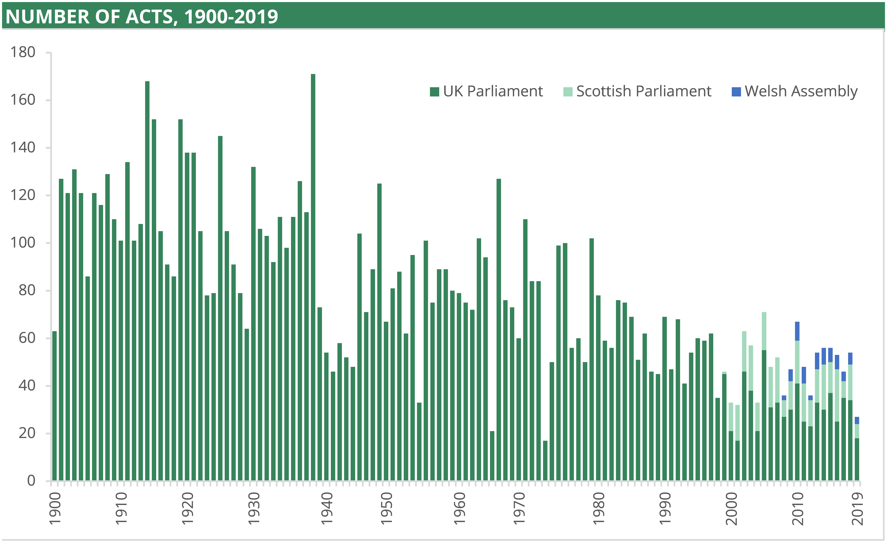
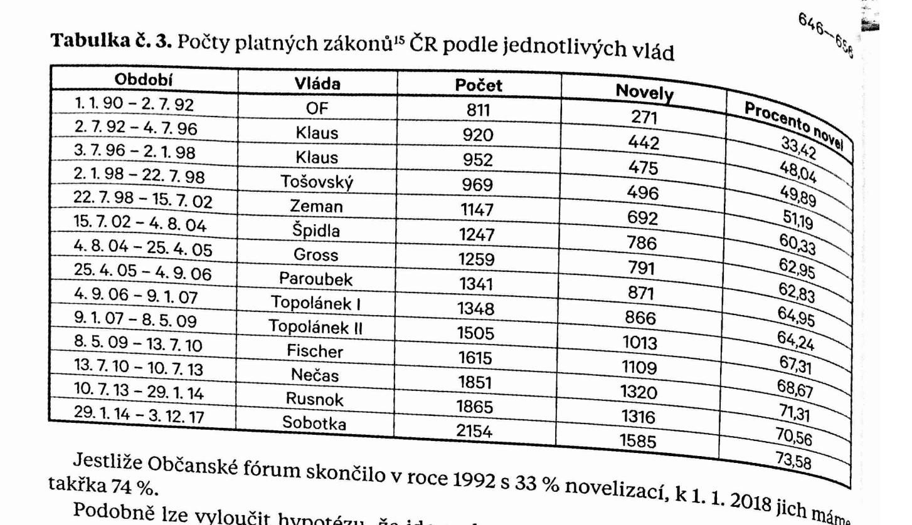

## United Kingdom

There has been a downward trend in the number of Acts passed in the UK from 1900 to present. From 1900 to 1939, an average of 112 Acts were passed each Parliamentary session. This declined to 78 Acts each session in the 1950s and 1960s. Each subsequent decade to 2010 has experienced a slight fall compared to the previous. In the 1970s, 73 Acts were passed each session on average, falling to 62 in the 1980s, 54 in the 1990s, 47 in the 2000s. There was then a small rise to 49 Acts each year in the 2010s.

Data relating to 2019 is correct as of June 2019, and includes legislation passed in Edinburgh and Cardiff within its totals. Data for the Parliament for Northern Ireland (1921-72) is incomplete, and not
included here.

Source: <https://commonslibrary.parliament.uk/research-briefings/cbp-7438/>

## Czech republic

Frantisek Cvrcek from Institute of State and Law of the Czech Academy of Sciences wrote a detail analysis to actual increase of laws and named it "Good regulated freedom". There were 30 % increase of words for last 6 years and the tempo of novelisation of laws was faster than in the times of change of regime after year 1989. He concluded that "Law is taken by poiticians as a tool of power to pursue particular interests of groups instead of creating rules for subjects of law to play fair."

Source: <https://www.ilaw.cas.cz/en/journals-and-books/journals/journal-pravnik/archive/2018/2018-8.html?a=3321>

## Conclusion

Trends for new legislation and change of laws are a very different country by country. The stability and predictability of law are significant pillars for spontaneous activity and development of private enterprise and mainly the prerequisite of justice. If the law is changed very often, it also brings other costs to all parties in case of a dispute. Please reconsider to use of arbitration in case of law overflow.
