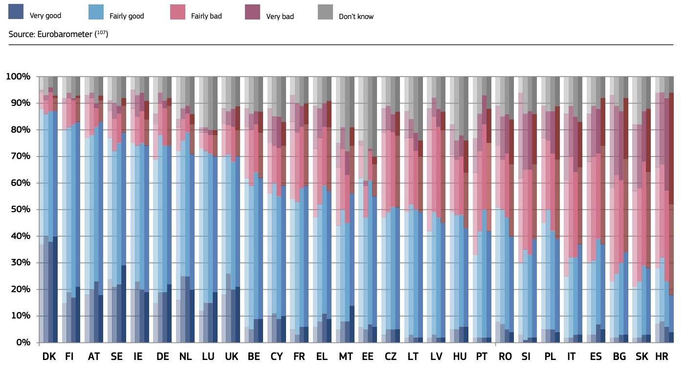

Dôvera verejnosti v nezávislosť sudcov a súdov

Členské štáty zoradené podľa percent respondendov, ktorí uviedli, že nezávislosť súdov a sudcov je veľmi dobrá alebo dobrá (celkovo dobré); ak nejaký členský štát mal rovnaké percento v celkovo dobrom hodnotení, boli ďalej zoradené podľa percenta respondentov, ktorí uvuedli, že nezávislosť súdov a sudcov je zlá alebo veľmi zlá (celkovo zlé). Ak nejaký členský štát ma rovnaké hodnotenie v celkovo zlé a celkovo dobré, sśu zoradené podľa počtu respondentov, ktorí uviedli hodnotenie veľmi dobré. Ak mali aj toto hodnotenie rovnaké, boli zoradení podľa počtu respondentov, ktorí uviedli veľmi zlé.

Slovensko je z meraných krajín druhá najhoršia a verejnosť skôr neverí v to, že by inštitúcie justície súdy a sudcovia boli nezávislí. Už od začiatku sledovania sa pohybuje na Chvoste medzi krajinami ako chorvátsko a Bulharsko.

Vzhľadom k tejto štatistike je paradoxné, že v krajinách západnej Európy je veľký počet arbitráží oproti Slovensku. Aj keď slováci nedôverujú v nezávislosť súdov a sudcov, predsa sa rozhodcovskému konaniu vyhýbajú. Som presvedčený, že je to tým, že pred rokom 1989 dlhú dobu hrál ústrednú roľu štát a jeho inštitúcie, pričom rozhodcovské konanie v súkromných majetkových sporoch bolo v dobe štátneho a družstevného vlastníctva nepodstatné. Rozhodcovské súdy a arbitri taktiež musia zapracovať na popularizácii arbitráží a ich zavedení do praxe. Rozhodcovské konanie má nielen tendenciu odľahčiť rozhodovanie štátnym súdom, ale aj získať späť svoju reputáciu.

Source: <https://ec.europa.eu/info/sites/info/files/justice_scoreboard_2019_en.pdf>
