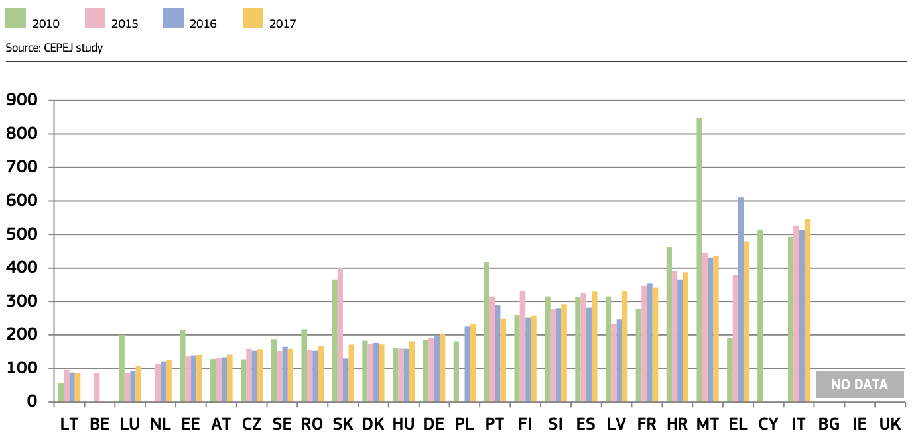
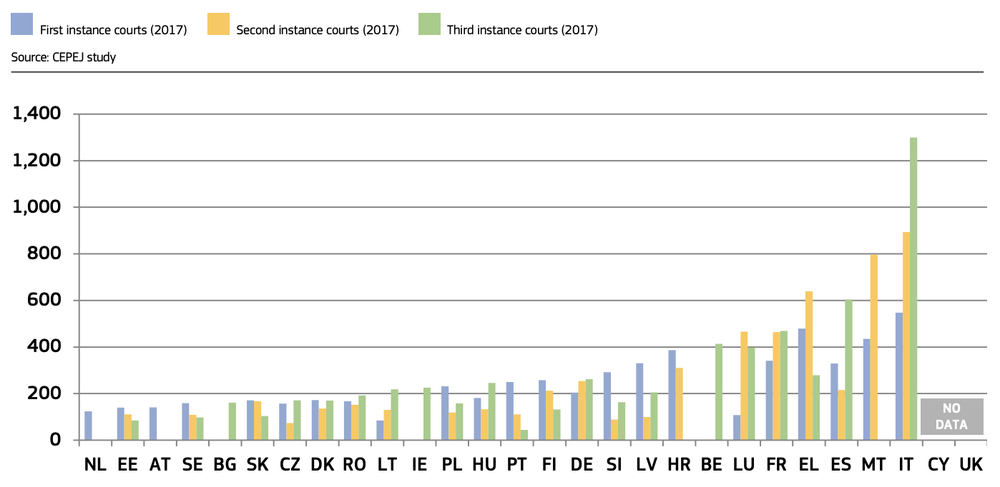
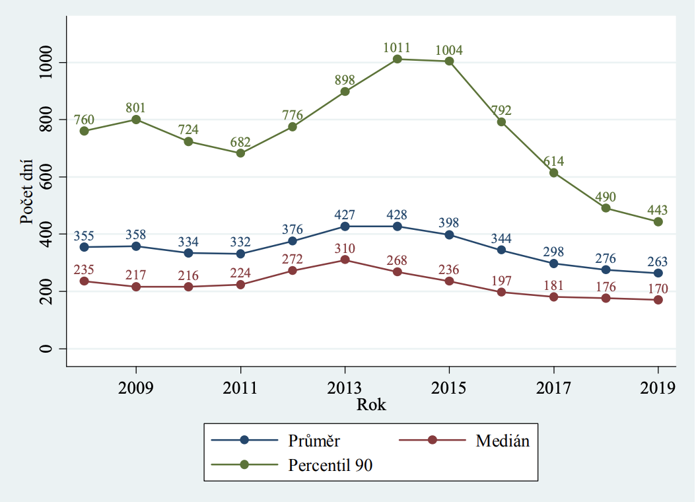
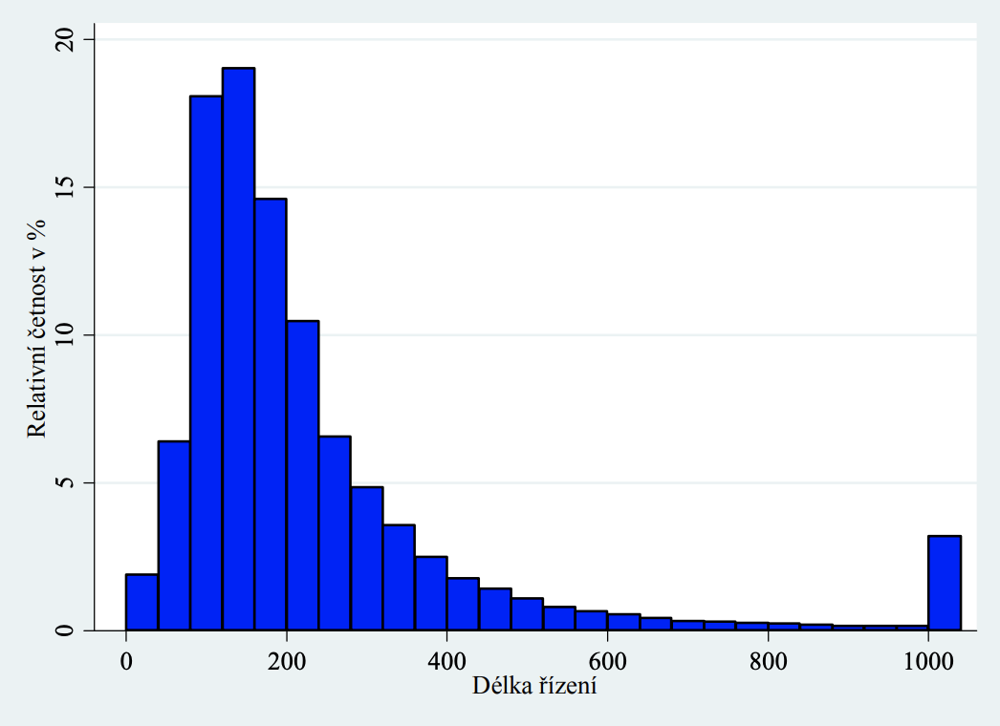
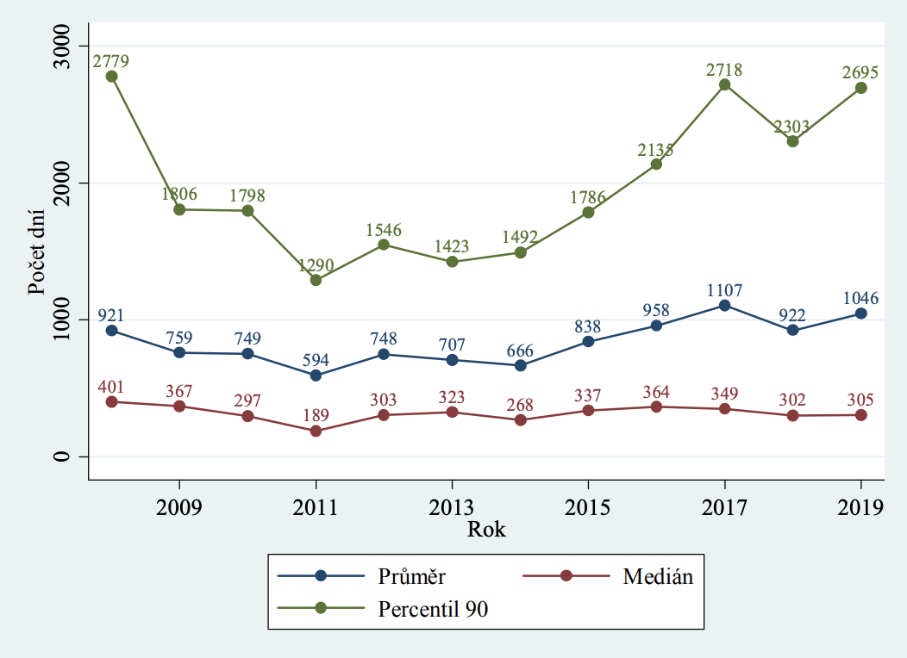
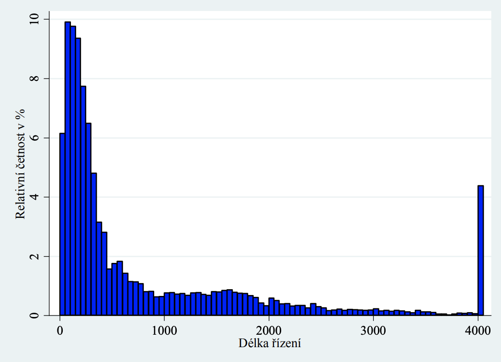
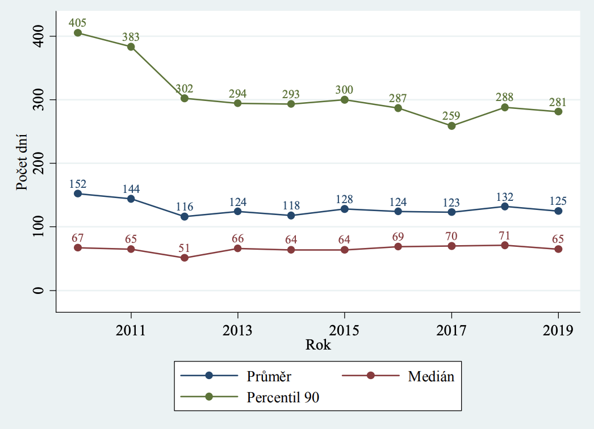
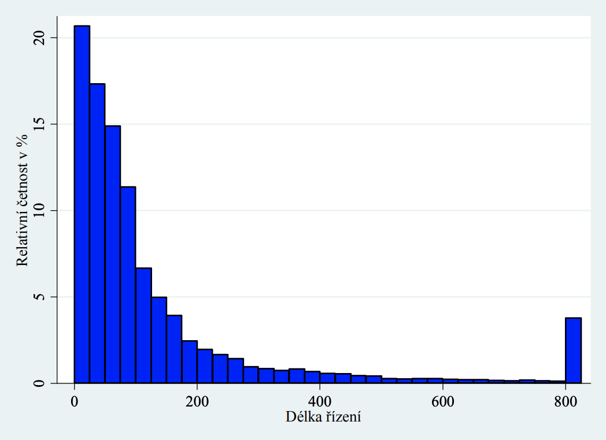

## Evropská unie

Pro srovnání se nejdřív podívejme na trend v Evropské unii. Na prvním obrázku je srovnání sporné civilní a komerční agendy pro první instanci (stupeň).

Sporná civilní a komerční agenda pro první instanci (stupeň). všechny instance v roce 2017 (první, druhá a třetí instance/počet dní)

Zdroj: <https://ec.europa.eu/info/sites/info/files/justice_scoreboard_2019_en.pdf>

## Česká republika

V soudním sporu lze postupovat pro změnu rozsudku do těchto instancí. Vzhledem k tomu, že soustava soudů je komplikovaná, začnu s jednoduchým modelovým příkladem.

**Stupeň**|**Instituce**|**Prostředek**|**Účinek**|**Čas**
:-----:|:-----:|:-----:|:-----:|:-----:
1.|obecný soud|žaloba|nic|263 dnů
2.|krajský soud|odvolání|vymahatelné|125 dnů
3.|nejvyšší soud|dovolání|změna|200 dnů
4.|ústavní soud|stížnost|změna|144 dnů
5.|evropský soud|žaloba|změna|500 dnů

Každá jedná instance (stupeň) je hůře průchodná, tzn. pokud neuspějete na obecném soudě, je malá pravděpodobnost, že vám nadřízený soud vyhoví. Podstatné pro vás je, jak rozhodne odvolací soud, jelikož od tohoto bodu se v zásadě rozsudek stáva vymahatelný. Spis se mezi soudama přesouvá fyzicky, někdy i několik měsíců.

### Okresní soudy - délka civilního řízení v letech 2008–2019

Aktuální průměrná délka soudního řízení na okresních soudech v prvním stupni je **263 dnů**.

Na tomto grafu je vidět rozložení případů podle délky řízení.

### Krajské soudy - délka civilního řízení v letech 2008–2019

Aktuální průměrná délka soudního řízení na krajských soudech v prvním stupni je **1046 dnů**.

Na tomto grafu je vidět rozložení případů podle délky řízení.

Zdroj: <https://justice.cz/documents/12681/719244/Ceske_soudnictvi_2019_vyrocni_stat_zprava.pdf>

### Krajské soudy - délka odvolacího civilního řízení v letech 2010–2019

Aktuální průměrná délka soudního řízení na krajských soudech v druhém stupni je **125 dnů**.

Na tomto grafu je vidět rozložení případů podle délky řízení.

### Třetí instance - dovolání

Dlouhodobě se průměrná délka řízení o dovolání u občanskoprávního a obchodního kolegia Nejvyššího soudu České republiky pohybuje už od roku 2016 na úrovni přibližně 200 dnů, v roce 2018 byla přesně **196 dnů**.

Zdroj: [Statistika Nejvyššího soudu za rok 2019](http://www.nsoud.cz/Judikatura/ns_web.nsf/web/Proverejnostamedia~TiskovezpravyNejvyssihosoudu~Nejvyssi_soud_znovu_podstatne_snizil_pocet_veci__ktere_zustaly_nevyrizeny_v_predeslem_roce_a_pravdepodobne_je_ceka_rozhodnuti_v_aktualnim_roce_2020__U_civilnich_dovolani_se_napriklad_snizil_pocet_tzv__nedodelku_o_temer_20_~?openDocument&lng=CZ)

### Čtvrtá instance - ústavní stížnost

Průměrná délka řízení u věcí ukončených v letech 2019:

- ve všech věcech **144 dní**
- ve věcech, v nichž bylo rozhodnuto nálezem 339 dní
- ve věcech, v nichž bylo rozhodnuto odmítnutím pro zjevnou neopodstatněnost 154 dní
- při ostatních způsobech ukončení řízení 88 dní

Zdroj: [Statistika Ústavního soudu za rok 2019](https://www.usoud.cz/fileadmin/user_upload/ustavni_soud_www/Statistika/VSA_2019.pdf)

### Court of Justice of the European Union

Průměrná délka řízení činí **550 dnů**.

>> The Court of Justice also saw the average duration of proceedings fall in 2018. If that average duration is analysed in terms of the type of action, it is apparent, however, that the duration of references for a preliminary ruling increased slightly, from 15.7 months to 16 months, whereas the duration of appeals fell significantly to 13.4 months, which represents an improvement of almost 4 months on 2017. The average duration of direct actions decreased considerably, from 20.3 months in 2017 to 18.3 months.

Zdroj: <https://curia.europa.eu/jcms/upload/docs/application/pdf/2019-03/cp190039en.pdf>

### European Court of Human Rights

Neuvedeno.

Zdroj: <https://www.echr.coe.int/Documents/Stats_analysis_2019_ENG.pdf>

## Závěr

Po setčení průměrných časů na vyřešení sporů všech českých instancí činí výsledek 732 dnů. Tento počet je ideální a nezahrnuje mezistupně jako předání spisu mezi soudama do času přidělení spisové značky a také nezahrnuje cyklické nebo opakované předávaní té samé věci mezi instancema. V případě, že se chcete pohybovat u rozhodnutí v řádech týdnů místo let, doporučuji zvážit vám a vašim obchodním partnerům arbitráž.
