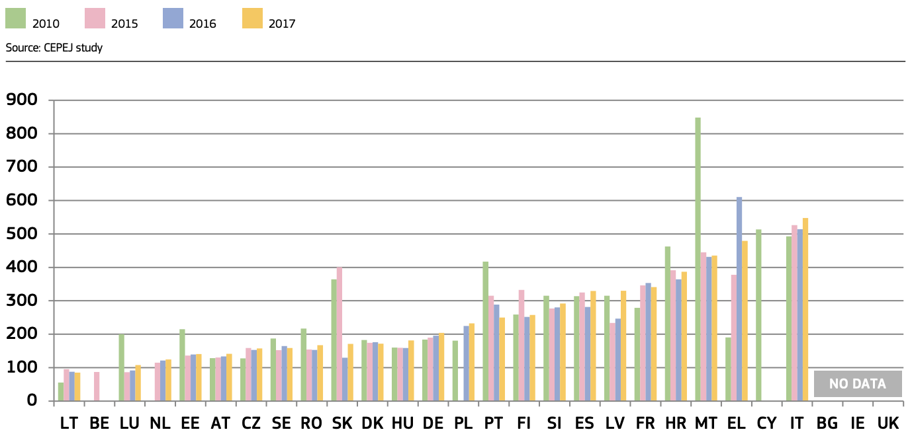

Time needed to resolve litigious civil and commercial cases  (1st instance/in days)

Time needed to resolve litigious civil and commercial cases (*) at all court instances in 2017 (1st, 2nd and 3rd instance/in days)

Source: <https://ec.europa.eu/info/sites/info/files/justice_scoreboard_2019_en.pdf>
